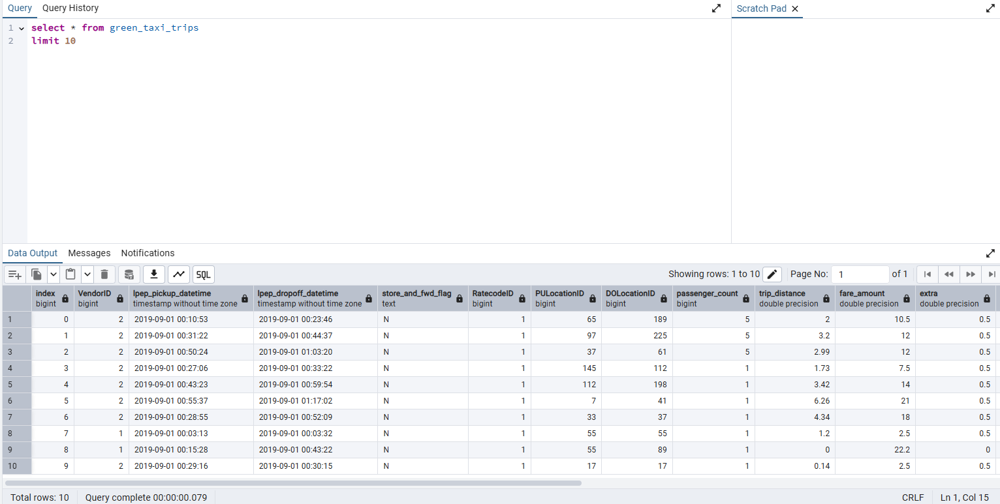
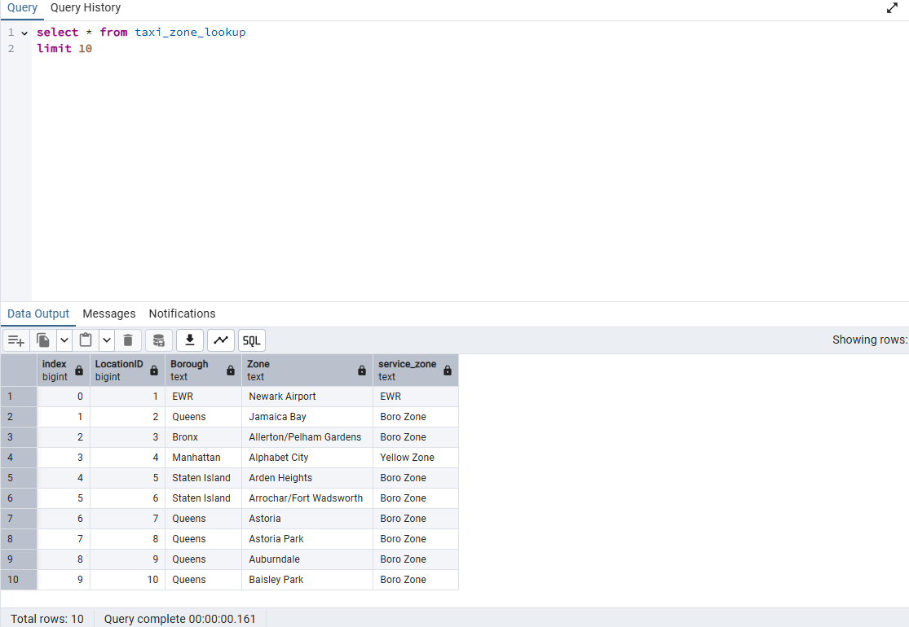

## Module 1 Homework (DRAFT)

ATTENTION: At the very end of the submission form, you will be required to include a link to your GitHub repository or other public code-hosting site. This repository should contain your code for solving the homework. If your solution includes code that is not in file format (such as SQL queries or shell commands), please include these directly in the README file of your repository.

## Docker & SQL

In this homework we'll prepare the environment 
and practice with Docker and SQL


## Question 1. Knowing docker tags

Run the command to get information on Docker 

```docker --help```

Now run the command to get help on the "docker build" command:

```docker build --help```

Do the same for "docker run".

Which tag has the following text? - *Automatically remove the container when it exits* 

- `--delete`
- `--rc`
- `--rmc`
- `--rm`

>SOLUTION
```bash
docker run --help


docker build --help
# --rm    Automatically remove the container when it exits
```
>ANSWER ✅
```
--rm
```


## Question 2. Understanding docker first run 

Run docker with the python:3.9 image in an interactive mode and the entrypoint of bash.
Now check the python modules that are installed ( use ```pip list``` ). 

What is version of the package *wheel* ?

- 0.42.0
- 1.0.0
- 23.0.1
- 58.1.0

>SOLUTION
```bash
docker run -it --entrypoint=bash python:3.9

# Status: Downloaded newer image for python:3.9
# root@033f6117637e:/# pip list
# Package    Version
# ---------- -------
# pip        23.0.1
# setuptools 58.1.0
# wheel      0.45.1

# [notice] A new release of pip is available: 23.0.1 -> 24.3.1
# [notice] To update, run: pip install --upgrade pip
```
When running docker run -it --entrypoint=bash python:3.9 and executing pip list, the displayed version of wheel is 0.45.1. However, this version is not listed among the provided answer options. Based on the available options, the closest version to the actual one, 0.42.0, was chosen as the correct answer.
>ANSWER ✅
```
0.42.0
```

# Prepare Postgres

Run Postgres and load data as shown in the videos
We'll use the green taxi trips from September 2019:

```wget https://github.com/DataTalksClub/nyc-tlc-data/releases/download/green/green_tripdata_2019-09.csv.gz```


You will also need the dataset with zones:

```wget https://s3.amazonaws.com/nyc-tlc/misc/taxi+_zone_lookup.csv```

Download this data and put it into Postgres (with jupyter notebooks or with a pipeline)

>SOLUTION
```bash
# insert green_taxi_trips table
docker run -it --network=pg-network taxi_ingest:v1 \
  --user=root \
  --password=root \
  --host=pg-database \
  --port=5432 \
  --db=ny_taxi \
  --table_name=green_taxi_trips \
  --url=https://github.com/DataTalksClub/nyc-tlc-data/releases/download/green/green_tripdata_2019-09.csv.gz

# insert taxi_zone_lookup table
docker run -it --network=pg-network taxi_ingest:v1 \
    --user=root \
    --password=root \
    --host=pg-database \
    --port=5432 \
    --db=ny_taxi \
    --table_name=taxi_zone_lookup \
    --url=https://github.com/DataTalksClub/nyc-tlc-data/releases/download/misc/taxi_zone_lookup.csv
```


## Question 3. Count records 

How many taxi trips were totally made on September 18th 2019?

Tip: started and finished on 2019-09-18. 

Remember that `lpep_pickup_datetime` and `lpep_dropoff_datetime` columns are in the format timestamp (date and hour+min+sec) and not in date.

- 15767
- 15612
- 15859
- 89009

>SOLUTION
```sql
select 
    count(*) total_
from 
    green_taxi_trips
where 
    DATE(lpep_pickup_datetime) >= '2019-09-18'
    and DATE(lpep_dropoff_datetime) < '2019-09-19' 

```
>ANSWER✅
```
15612
```
## Question 4. Longest trip for each day

Which was the pick up day with the longest trip distance?
Use the pick up time for your calculations.

Tip: For every trip on a single day, we only care about the trip with the longest distance. 

- 2019-09-18
- 2019-09-16
- 2019-09-26
- 2019-09-21

>SOLUTION
```sql
select 
	DATE(lpep_pickup_datetime) pick_up_day 
from 
	green_taxi_trips
ORDER BY 
	trip_distance DESC
LIMIT 1
```
>ANSWER ✅
```
2019-09-26
```

## Question 5. Three biggest pick up Boroughs

Consider lpep_pickup_datetime in '2019-09-18' and ignoring Borough has Unknown

Which were the 3 pick up Boroughs that had a sum of total_amount superior to 50000?
 
- "Brooklyn" "Manhattan" "Queens"
- "Bronx" "Brooklyn" "Manhattan"
- "Bronx" "Manhattan" "Queens" 
- "Brooklyn" "Queens" "Staten Island"

>SOLUTION
```sql
SELECT DISTINCT 
	"Borough",
	SUM(total_amount) AS total_amount_sum
FROM 
	green_taxi_trips g
join 
	taxi_zone_lookup t
on 
	g."PULocationID" = t."LocationID"
WHERE
	DATE(lpep_pickup_datetime) = '2019-09-18'
AND 
	"Borough" != 'Unknown'
GROUP BY
	"Borough"
HAVING
	SUM(total_amount) > 50000
ORDER BY
    total_amount_sum DESC
LIMIT 
	3
```
>ANSWER ✅
```
"Brooklyn" "Manhattan" "Queens"
```

## Question 6. Largest tip

For the passengers picked up in September 2019 in the zone name Astoria which was the drop off zone that had the largest tip?
We want the name of the zone, not the id.

Note: it's not a typo, it's `tip` , not `trip`

- Central Park
- Jamaica
- JFK Airport
- Long Island City/Queens Plaza

>SOLUTION
```sql
SELECT  
	t2."Zone"
FROM 
	green_taxi_trips g
join 
	taxi_zone_lookup t1
on 
	g."PULocationID" = t1."LocationID"
join 
	taxi_zone_lookup t2
on 
	g."DOLocationID" = t2."LocationID"
WHERE
    EXTRACT(
        YEAR
        FROM
            lpep_pickup_datetime
    ) = 2019
AND EXTRACT(
        MONTH
        FROM
            lpep_pickup_datetime
    ) = 09
AND
	t1."Zone" = 'Astoria'
ORDER BY
    tip_amount DESC
LIMIT 
	1
```
>ANSWER ✅
```
"JFK Airport"
```

## Terraform

In this section homework we'll prepare the environment by creating resources in GCP with Terraform.

In your VM on GCP/Laptop/GitHub Codespace install Terraform. 
Copy the files from the course repo
[here](https://github.com/DataTalksClub/data-engineering-zoomcamp/tree/main/01-docker-terraform/1_terraform_gcp/terraform) to your VM/Laptop/GitHub Codespace.

Modify the files as necessary to create a GCP Bucket and Big Query Dataset.


## Question 7. Creating Resources

After updating the main.tf and variable.tf files run:

```
terraform apply
```

Paste the output of this command into the homework submission form.

>ANSWER ✅
```
andyoso@LAPTOP-2SVHURIR:~/data-engineering-zoomcamp-2025/01-docker-terraform/2_terraform_gcp$ terraform apply
google_storage_bucket.data-lake-bucket: Refreshing state... [id=wired-name-443713-g5-andy-bucket]

Terraform used the selected providers to generate the following execution plan. Resource actions are indicated with the following     
symbols:
  + create

Terraform will perform the following actions:

  # google_bigquery_dataset.dataset will be created
  + resource "google_bigquery_dataset" "dataset" {
      + creation_time              = (known after apply)
      + dataset_id                 = "dataset"
      + default_collation          = (known after apply)
      + delete_contents_on_destroy = false
      + effective_labels           = {
          + "goog-terraform-provisioned" = "true"
        }
      + etag                       = (known after apply)
      + id                         = (known after apply)
      + is_case_insensitive        = (known after apply)
      + last_modified_time         = (known after apply)
      + location                   = "asia-east1"
      + max_time_travel_hours      = (known after apply)
      + project                    = "wired-name-443713-g5"
      + self_link                  = (known after apply)
      + storage_billing_model      = (known after apply)
      + terraform_labels           = {
          + "goog-terraform-provisioned" = "true"
        }

      + access (known after apply)
    }

Plan: 1 to add, 0 to change, 0 to destroy.

Do you want to perform these actions?
  Terraform will perform the actions described above.
  Only 'yes' will be accepted to approve.

  Enter a value: yes

google_bigquery_dataset.dataset: Creating...
google_bigquery_dataset.dataset: Creation complete after 1s [id=projects/wired-name-443713-g5/datasets/dataset]

Apply complete! Resources: 1 added, 0 changed, 0 destroyed.
## Submitting the solutions

* Form for submitting: https://courses.datatalks.club/de-zoomcamp-2024/homework/hw01
* You can submit your homework multiple times. In this case, only the last submission will be used. 

Deadline: 29 January, 23:00 CET
